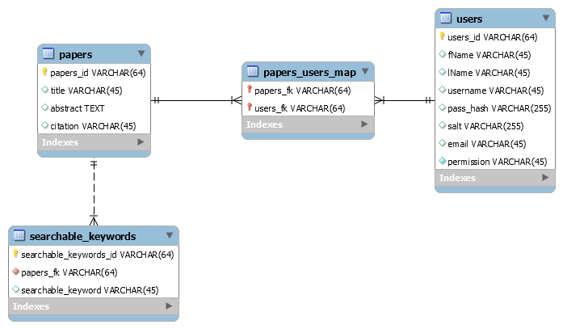

# Faculty Research Database
A web application that allows users to view and share research papers.

The focus of this project was to learn how to connect a database from the backend to the business layer to the presentation layer. It does not follow all good security or development practices.

#Security Warning

**This project is susceptible to XCC and potential SQL injections.**

#Development Warning

**This project does not include any tests. There should be tests to ensure features work correctly, the addition of features do not break other feature, and the security of the application is maintained.**

##High Level Architecture

##How to Setup and Run The Application

1. Download and install Node.js: <a href="https://nodejs.org/en/download/">Download Here</a>
2. Add node.js to the system path.

      Test by running the following command in bash or cmdline:

      `c:\>node --version`

      If there was no error you have successfully installed Node JS

      Now make sure NPM (Node.js Package Manager) is installed:

      `c:\>npm --version`

      If there was no Error you have successfully NPM was also successfully installed

3. Installing the Dependencies

    To download and install the dependencies run the following command in bash or cmdline:

    `c:\>npm install`

4. Getting MySQL Installed and Running

      Download and install MySQL: <a href="http://dev.mysql.com/downloads/mysql/">Download Here</a>

      Test by running the following command in bash or cmdline:

        `c:\>mysql --version`

      To Run MySQL type the following command in bash or cmdline:

        `c:\>mysqld --port=3306`

5. Database Setup

    Inside /src/database there is the db_schema.sql and the db_populate.sql
    Add these to the database, first the schema then the populate.

 6. Config File

      The config file is the place to change the database name, ports, and host ip.

 7. Running the Application

    Go to the project folder and type the following command in bash or cmdline:

    `c:\......\DB-330-FRD>node app.js`

    That should start the server on port 7000

 8. Extra Info

      Default Public User:

      `username: username1`,
      `password: pass_hash`

      Default Student User:

      `username: username2`,
      `password: pass_hash`

      Default Faculty User:

      `username: username3`,
      `password: pass_hash`

      Default Admin User:

      `username: username4`,
      `password: pass_hash`

##Application Design

###Domain Model

**Views:** Are created by the App Controller. Displays the data provided by the app controller. Talks to the App Controller via HTTP requests/responses. They use JavaScript, jQuery, and CSS files.

**App Controller:** Handles the requests and responses from the views. Calls certain middleware to run depending on the request/data received. Renders the views. Sends error codes and messages to the views. Is in charge of authentication and authorization.

**Middleware:** Is used by the application controller to get and manipulate certain data from given database tables.

**User Model Middleware:** Gets and manipulates data in the database pertaining to a User. Ex: Gets all papers of a given user.

**Paper Model Middleware:** Gets and manipulates data in the database pertaining to a Paper. Ex: Gets all keywords and searchable keywords for a paper.

**Search Model Middleware:** In charge of getting papers data in the database by keywords. Ex: Uses keywords and searchable keywords to get specific papers and their info.

**Database Pool:** This represents the MySQL Driver/Library we are using. Inside there is an easy way to create a database pool. This will allow for many users to access this application at once without having to worry about the overhead caused by creating a database connection.

###Database Schema

